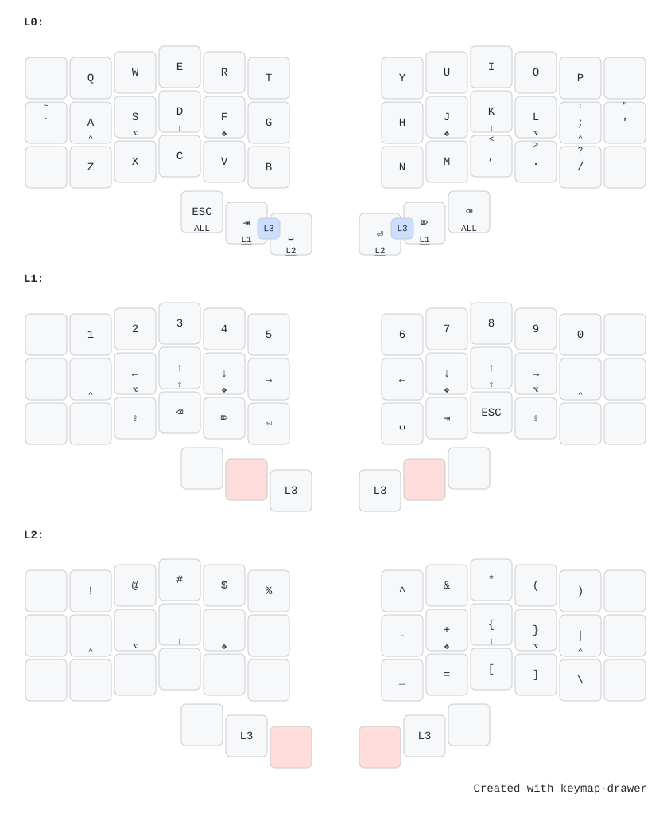
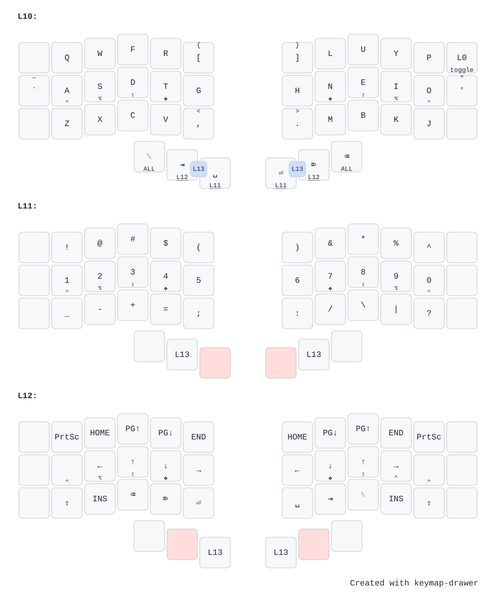
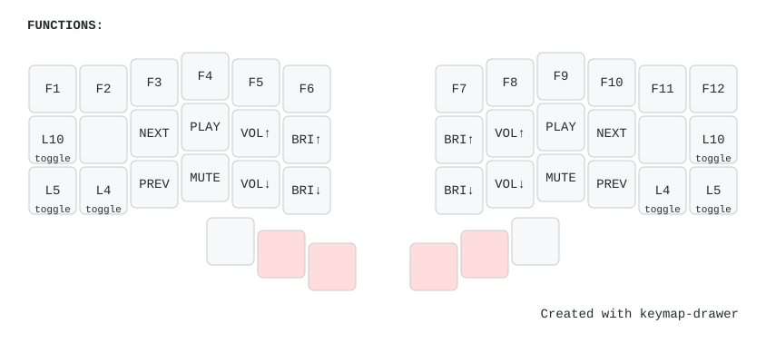
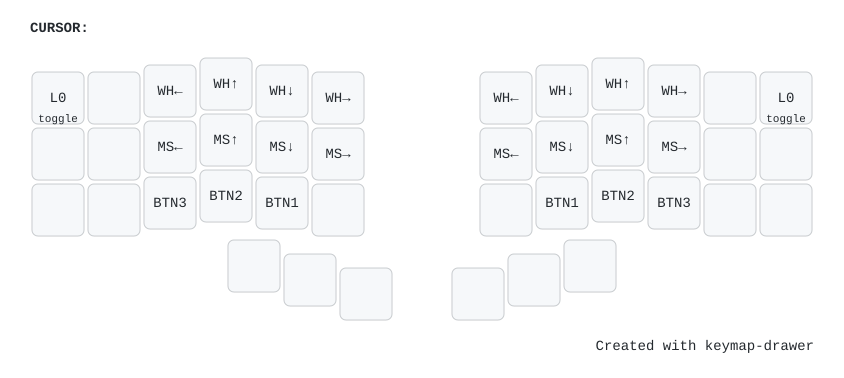
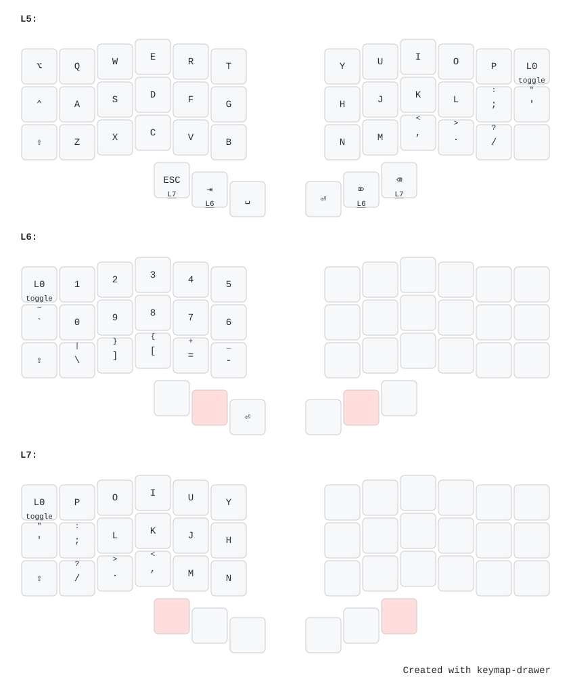

# Piantor Pro 42 Keyboard Configuration

A split keyboard, 3x6 column staggered keys + 3 thumb keys.

## Core Ideas

- Thumb keys will function as tap keys for most common actions: Esc, Tab, Space, Enter, Delete, Backspace; and hold keys for Hyper and core layers.
- Home Row Mods
  - Ctrl-Alt-Shift-Super :: Super-Shift-Alt-Ctrl
  - Available in main layers (L0-L2 and L10-L12) except for gaming.
- Discourage use of corner keys (top and bottom outter column keys) to reduce stretching of pinky fingers. This may later allow us to transition to a 3x5 setup.
- Toggable Layers:
  - Toggable layers are not immediately available to prevent accidental switching. Instead they're available via the Function layer which is accessible via a combo key.
  - Then in toggable layers (e.g., L4, L5, L10, L14) the top outter key is reserved as a reset key to go back to base.
- Encourage one-handed access for when combined keyboard-cursor work is required. This includes:
  - Mirroring certain keys and layers so they're accessible on both sides, including: editing, navigation, function, and media keys.
  - Providing alternative access to certain keys on the opposite side.

## Main Layout

The main every day layer setup. Easiest for transitioning from a standard keyboardas it keeps most of the QWERTY layout with some ligh upgrades across layers. View in [Keymap Drawer](https://caksoylar.github.io/keymap-drawer?keymap_yaml=H4sIAAAAAAACA5WUy27TQBSG93mKYbiDQ5O49GKuoZTrQIG2QElck1BLreLEIUklohA2SMkmglIkdqxQQYK38pMw_3DsxOG0gs1n6T9zLvMf20GlG-52nIwQr-s1r-Z3q2GlteWIqu_XfL8609ypNDphS8cDc9JrVOq-I1RxY2V9zWs3g52OZ7-Z8-yMjvutNiqpHChEVpSktIR8DDwDloEnwBqwAawDd4EV4BEg3bhAr-MI-VJrbf18J_uWMEpRK9v6GY3eJ9pqoh0k2s1YG_5ItFux9vULNHkbHe9Iit5LR412n6mimG6XaE6Hme40xcpS9t2UPS-A58AS8BS4ATwEHsSDWVTgclLyAilXE2WGlGvmYlMuLq8u0VxFpZKUaHhAqsqPxb1vsVgYix8_MOLoO5M--jXZCWOofPJONHaDQE-Xx-0KgA3MAheBOWAeWAAWgZwG8tx0EdONMTsa7DHriQafmEVGg89TL0Q02JdWXIQ_c2S9faZ3ekjmKuRKNPxpehsHyV1ynrZCG6N1UsK4xl8OdZv6e5XbfrBlLqeM24bTsThdFaZ3dQw514HjwAngJLAJnALOAWeAs_-3qyPMmnA1bT-NlY33c57ZTo-p0meavf3H1RxG6eHSV4AS4ALlMm8Cbzy_pD_pmVdhvRqa_2pW9JqOKNnzlrAXXEvUHDoZaFWqnHT7E6cWLTGbO-TUbxAReVD2BQAA).

- Layer 0: Base
  - QWERTY Layout - Mostly untouched except for the outer columns.
- Layer 1: Numbers, Arrows, and Thumbs
  - First row: Number row
  - Second row: Arrow keys in VIM layout. Mirrored for left hand as well.
  - Third row: Mirrors the thumb keys to make them accessible to the other hand + caps lock.
- Layer 2: Symbols
  - First row across: Symbols row (Shifted numbers)
  - Remaining right pad keys are used for symbols. These try to find certain logic in how they're moved from their original QWERTY position but this is very subjective.
  - Still looking for better use of left pad. This really tempts me to remove the outter pinky columns altogether.

## Alternative (Ballena?) Layout (10/11/12)

Custom layout that aims to push letters least used away and balance out symbol keys while maintaining support, function and media keys accessible to both hands. View in [Keymap Drawer](https://caksoylar.github.io/keymap-drawer?keymap_yaml=H4sIAAAAAAACA4WUXW8SQRSG7_kV41g_u9jdbu3H-okWa3ULVVq1wnaFdtM2LCzCNpEg3pjADVFsE2-MV6aa6L_aX-K8w8yWJYPePAzvnHnP4ZwZ_HI7OA6tFCFva1W36rUrQbm5b5GK51U9rzLXOCrXw6DJ9n0e6dbLNc8idmYnv73lthr-Ueia7xZdM8X2vWYLTrah44OQNClSqhH6DHgJPAKeM3RCi9AiW7TYZ4d2heIIpQuF2ojeBnaATXnO1tnqkC3C4ODA92jXken49hth8iG2zYj4aPAx1gqxdhZrq1Lr_4q1Lal9_8qLWkMpj2UpueQu17IKl3VFtryiqiui9hId-1W8ia-BV8BD4IWsQBMnbsceN4Ryl9e7gegHwFPgCUCTDYuG30QpGduObaL-mVBtY_5cHf6IVeNc_fxJpQ5-qhwGf8azOfzGGPGNqR_7PivxAuq8D1wEZoCrwDXgMnAduATsMuCckzTh6QxFl-cV0zAVU1uYmP1NJFuUnV9SzH5Z4bKiyKYnq1IUT10kSwOzwB3gFmABc0CpBL4H7qlbwDpv8nrbDfZs6aHn749qSH4XYdKAjWtyHpvNsLDHr35-I8tf41rU-yIXp1hkc6uTAaeJSBEgraZNTDGwqDdUNHFkO9nuUdbxsUW9E6pJE3XMP_1OFBX9f35R_zeyrucKPDm_9eJJiPciHpN4aeIZxgf4cWWPlLObMumRQWovqFUC_u-cJp2GRYrmkkbMZUcjVUse9ZnMljp1umNxKxpZ0KfG_QUIfupkQAYAAA%3D%3D).

Full disclosure, I haven't yet moved to it but this layout makes so much sense to me every time I work on it. 

- Layer 10:
  - Colemak/Workman inspired custom layout.
  - Rearranges keys based on usage frequency.
  - Brings often used symbols to the inner column's top and bottom positions.
- Layer 11:
  - Combines remaining numbers and symbols in a single layer.
  - Moves parenthesis and other symbols to match location of similar symbols from the base layer (subjective).
- Layer 12:
  - Access to arrow keys as h/j/k/l and its mirror s/d/t/g.
  - Access to navigation and control keys such as Home, End, Page Up, Page Down, Insert, Print Screen, Caps Lock.

## Other Layers

### Functions Layer (3/13)

Momentary layer, meant to be accessed holding two thumb keys together (one hand). Gives access to function and media keys. View in [Keymap Drawer](https://caksoylar.github.io/keymap-drawer?keymap_yaml=H4sIAAAAAAACA8tJrMwvLbHiUlAozM2Oz06tTMpPLEqxUkhKTc1OTU3SL8hMzCvJLwLK54BVxucl5qZaKfg4RvqHhsQXF-RklsQbV5jFG3MB5VOLikEmuYX6OYd4-vsFgzgKCroK0Upuhko6CkpuRmDSGEyagElTMGkGJs3BpAWYtASThgYQCqLb0EgpFmZidYmVgpIPWD4DyCrJT0_PSVWq1VHIK83JASr2c40IAWkKALoURIf5-zxqmwhiOQV5YrAQsjD1UP0Q03BYhuYYUwy3QMRNMMSVAoJcw0C2-IaGuMLtnwx3ExoLIQtTD9WPy3zs7oE7F-apygJgTCplpOakQDSRxgeZEsvFBQDtsFJ0QQIAAA%3D%3D).

### Cursor Layer (4/14)
Toggable layer, meant to give access to cursor and scroll keys. View in [Keymap Drawer](https://caksoylar.github.io/keymap-drawer?keymap_yaml=H4sIAAAAAAACA8tJrMwvLbHiUlAozM2Oz06tTMpPLEqxUkhKTc1OTU3SL8hMzCvJLwLK54BVxucl5qZaKfg4RvqHhsQXF-RklsQbV5jFG3MB5VOLikEmOYcGBfsHgVgKCroK0dUlVgpKPgZKOgoZQEZJfnp6TqpSrY5CXmlOjo6CUrjHo7YJSlDGRBhjMowxSQldzWQMxSA1ENOw2xULcwpEEdRi32CooSDGRBhjMowxSQldzWQMxQiLQSR2a5xC_IyVILQRlDZE0YYQQ1ZjTNho7GQsFwCsBj_81AEAAA%3D%3D).

I know, I know... a bit extreme and I don't think I've meaningfully used it but it'd be nice to have a way to control the cursor/scroll/clicks sometimes that does not involve purchasing a new keyboard with trackpad (_... already on its way_).

### Gaming Layout (5/6/7)
A gaming layer that strips out multi action keys and allows access to all keys through the left pad only. View in [Keymap Drawer](https://caksoylar.github.io/keymap-drawer?keymap_yaml=H4sIAAAAAAACA52TzU4CMRSF9zxF040L8RcddPwLKio4CgqoCGSE2IhhYBDGRIK4ccGGqO9g0IVvNU9iT-k0TEANbj6a0_Zc7tweq9iy7x09QMhdtWJWWKtkFxvXOikxVmGsNFe_LdYcu8H3LXHSrBWrTCdGJJvIpM1m3bp1zNCDZoYCfJ81mnAylkFCZkiOur0-DRJ6ApwDUeAUSANZIAPEgASQ5Gg7OqHGPF-V-cKxb24sRjuFId9nHI0AKWAX2AP2gQMgDhwChme5xhdN_qvTjlSmpJKnPv_uJ-5dAhfADnAGbAPHwJHnGpQe68p1ViqbSpmTyhYUSlUpsRlN7chWjbC64Xb7nqiJS-7bO8q6ry9eYbf34Tsixa8hMxQyNN1XbuTDctcFWC8CIWAJWOao3VvW7_S3ciX7fBKuKERXgRUgDGiTucpZCPN8Xro_qm4LUukoJSeVtlI2pDKtlBmpmFAm-DMDqe206jwFtMys68FkxEjGb3r3jfDfQ0iqEMRUMLL_GMLwox738kUgBtGIe3H550h87_qHt-_Lh4iNCNBEXY1-1HH0nysEvgGvxttr4AQAAA%3D%3D).

- Removes Home Row Mods and places them in side and bottom keys.
- Allows quick access to nearly all keys with one hand.
  - Layer 6 gives access to numbers and symbols.
  - Layer 7 left pad mirrors right pad characters.
  - This does not have complete coverage but prioritizes most used keys.
- Some remapping may still be required depending on the game style.
- Tested with platformers, FPSs, and RPGs.

## Changelog

- v1 (2023-12) - Initial configuration. Very close to the default Piantor setup.
- v2 (2024-01) - Added a few more layers and macros, testing custom tap dance functions.
- v3 (2024-03) - Reverts back to Mod-Tap due to better functioning and easier management. Rearranges keys and adds All Mod combos.
- v4 (2024-04) - Changes to home row mods setup. Changes media to layer 3 and makes available to both hands. Cleans up old configuration.
- v5 (2024-06) - Adds alternative keyboard layout (layer 10/11/12). Very experimental, barely used.
- v6 (2024-08) - Moves numpad to layer 3, adds a gaming layout to layer 4, mirrors arrow keys on left side of keyboard (layer 1). Moves toggle keys. Copies some of the changes to experimental layers.
- v7 (2024-12) - Moves gaming layer to 5/6 and changes modifier keys based on what I'm already used to. Adjusts other layer keys based on usage.
- v8 (2026-08) - Changes function and media keys to be accessible via combo thumb key press. Refines gaming layer based on actual usage. Further pushes alt layout's style and philosophy.
